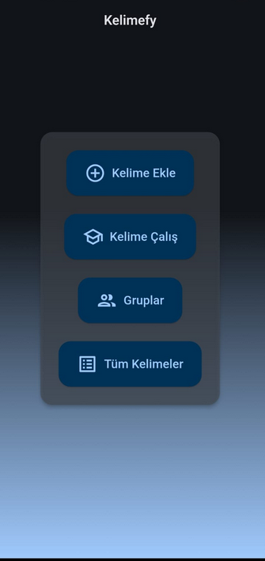
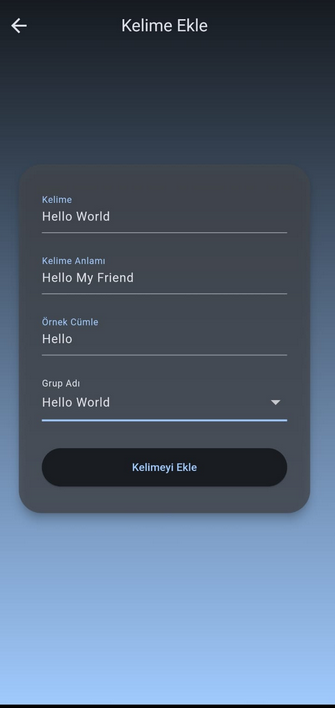
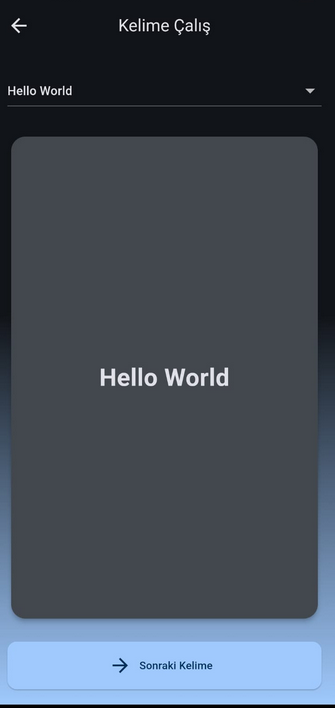
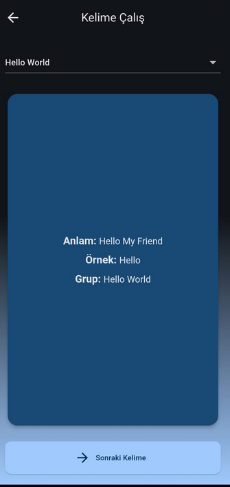

# Kelimefy - Bilgi Kartı Kelime Öğrenme Uygulaması

Kelimefy, kullanıcıların bilgi kartları ve kelime gruplama yoluyla yeni kelimeler öğrenmelerine ve kelime dağarcıklarını genişletmelerine yardımcı olmak için tasarlanmış Flutter tabanlı bir mobil uygulamadır.

## Ekran Görüntüleri


| Ana Ekran | Kelime Ekle | Kelime Çalış |
|---|---|---|
|  |  |  |

| Kelime Anlam  | Gruplar | Grup Kelimeleri |
|---|---|---|
|  |  |  |

## Özellikler

- **Kelime Ekle:** Anlamları ve örnek cümleleriyle kolayca yeni kelimeler ekleyin.
- **Kelime Grupları:** Hedefli öğrenme için kelimeleri özel gruplar halinde düzenleyin.
- **Bilgi Kartlarıyla Çalışma:** Kelimeleri ve anlamlarını/örneklerini görmek için kartları çevirin.
- **Gruba Özel Çalışma:** Çalışma oturumlarınızı belirli kelime gruplarına veya tüm kelimelere odaklayın.
- **Tüm Kelimeleri Görüntüle:** Eklenen tüm kelimelerin gruba göre filtrelenebilir kapsamlı bir listesine göz atın.
- **Kelimeleri Düzenle ve Sil:** Mevcut kelime ayrıntılarını değiştirin veya artık ihtiyaç duymadığınız kelimeleri kaldırın.
- **Grupları Yönet:** Yeni kelime grupları oluşturun ve mevcut olanları silin (varsayılan "Tüm Kelimeler" grubu hariç).
- **Kalıcı Depolama:** Kelimeleriniz ve gruplarınız `shared_preferences` kullanılarak yerel olarak kaydedilir.
- **Kullanıcı Dostu Arayüz:** Hoş bir gradyan temasına sahip temiz ve sezgisel tasarım.

## Başlarken

Yerel bir kopyayı kurup çalıştırmak için bu basit adımları izleyin.

### Önkoşullar

- Flutter SDK: [Kurulum Kılavuzu](https://flutter.dev/docs/get-started/install)
- Dart SDK (Flutter ile birlikte gelir)
- VS Code veya Android Studio gibi bir düzenleyici

### Kurulum

1.  Depoyu klonlayın
    ```sh
    git clone https://github.com/brky06/kelimefy.git 
    ```
2.  Proje dizinine gidin
    ```sh
    cd kelimefy
    ```
3.  Flutter paketlerini yükleyin
    ```sh
    flutter pub get
    ```
4.  Uygulamayı çalıştırın
    ```sh
    flutter run
    ```

## Kullanılan Teknolojiler

- **Flutter:** Mobil, web ve masaüstü için tek bir kod tabanından yerel olarak derlenmiş uygulamalar oluşturmaya yönelik kullanıcı arayüzü araç takımı.
- **Dart:** Flutter geliştirmesi için kullanılan programlama dili.
- **shared_preferences:** Yerel veri kalıcılığı için.
- **flip_card:** Bilgi kartı animasyonu için.

## Yazar

- **GitHub:** [brky06](https://github.com/brky06)

## Katkıda Bulunma

Katkılar, açık kaynak topluluğunu öğrenmek, ilham vermek ve yaratmak için harika bir yer haline getiren şeydir. Yaptığınız her katkı **büyük takdir görmektedir**.

Bunu daha iyi hale getirecek bir öneriniz varsa, lütfen depoyu çatallayın ve bir pull request oluşturun. Ayrıca "enhancement" etiketiyle bir issue açabilirsiniz.
Projeye bir yıldız vermeyi unutmayın! Tekrar teşekkürler!

1.  Projeyi Çatallayın (Fork)
2.  Özellik Dalınızı Oluşturun (`git checkout -b feature/AmazingFeature`)
3.  Değişikliklerinizi Ekleyin (`git commit -m 'Add some AmazingFeature'`)
4.  Dala Gönderin (`git push origin feature/AmazingFeature`)
5.  Bir Pull Request Açın

## Lisans

MIT Lisansı altında dağıtılmaktadır. Daha fazla bilgi için `LICENSE` dosyasına bakın.
*

Bu proje hakkında herhangi bir sorunuz varsa, lütfen [brky06](https://github.com/brky06) ile iletişime geçin.

